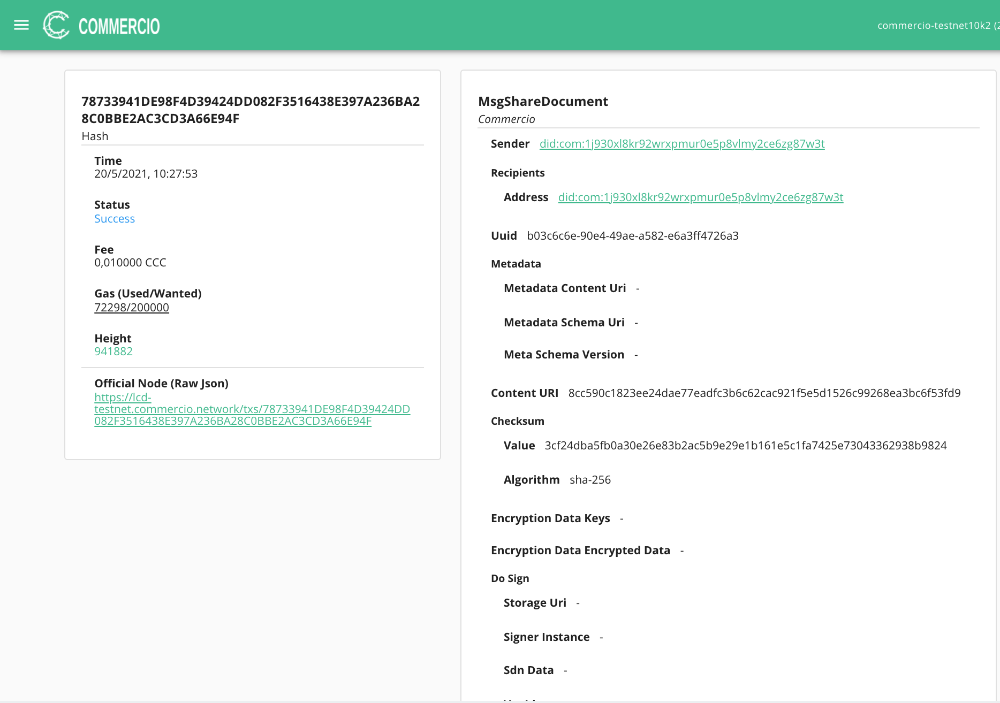

# CommercioAPI DOCS

The  CommercioAPI DOCS allows you to share a document with another user, and retrieve the list of documents that you have received.


## What is an Electronic Cerified Delivery?

**IMPORTANT!!!**

* We are not actually sharing Documents on a blockchain. 
* We are sharing a transaction on a blockchain with a document footprint (HASH) 

An hash is the output of a hashing algorithm like SHA (Secure Hash Algorithm). These algorithms essentially aim to produce a unique, fixed-length string – the hash value, or “message digest” – for any given piece of data or “message”. 

As every electronic file is just data that can be represented in binary form, a hashing algorithm can take that data and run a complex calculation on it and output a fixed-length string as the result of the calculation. 

The result is the file’s hash value or message digest.

'Sharing a Document' on Commercio.network means sending a shareDoc transaction on a blockchain with your document hash.


## shareDoc Trasaction

### shareDoc real world use cases

* Legally prove a document was shared with a third party
* Timestamp a document 
* Prove the existence of document 
* Notarize a document  


See folowing guides for more technical details on  <a href="/x/documents/#sending-a-document">MsgShareDocument</a> using the <a href="/x/documents/#docs">DOCS MODULE</a>


### Step by step Example

Let's create a new transaction to share the document hash (REMEMBER not the actual document, only the hash ) associated with the given contentUri and having the given metadata and checksum. 

#### Step 1 - Define message datas 

Following datas are used  
* Your account address : es `did:com:1j930xl8kr92wrxpmur0e5p8vlmy2ce6zg87w3`
* Account address of the recipient/s: es `did:com:1j930xl8kr92wrxpmur0e5p8vlmy2ce6zg87w3`
* Hash of the document with `sha-256` algorithm: `3cf24dba5fb0a30e26e83b2ac5b9e29e1b161e5c1fa7425e73043362938b9824`
* Encripted content uri : `8cc590c1823ee24dae77eadfc3b6c62cac921f5e5d1526c99268ea3bc6f53fd9`

```
{
  "content_uri": "8cc590c1823ee24dae77eadfc3b6c62cac921f5e5d1526c99268ea3bc6f53fd9",
  "hash": "3cf24dba5fb0a30e26e83b2ac5b9e29e1b161e5c1fa7425e73043362938b9824",
  "hash_algorithm": "sha-256",
  "recipients": [
    "did:com:1j930xl8kr92wrxpmur0e5p8vlmy2ce6zg87w3t"
  ],
  "sender": "did:com:1j930xl8kr92wrxpmur0e5p8vlmy2ce6zg87w3t",
  "type": "basic"
}
```

#### Step 2 - Send the message 

Use the API POST : /sharedoc/process 


**API : Body response**

```
{
  "process_id": "34669051-707f-4230-a960-e0ef8e517e43",
  "sender": "did:com:1j930xl8kr92wrxpmur0e5p8vlmy2ce6zg87w3t",
  "receivers": [
    "did:com:1j930xl8kr92wrxpmur0e5p8vlmy2ce6zg87w3t"
  ],
  "document_id": "b03c6c6e-90e4-49ae-a582-e6a3ff4726a3",
  "doc_hash": "3cf24dba5fb0a30e26e83b2ac5b9e29e1b161e5c1fa7425e73043362938b9824",
  "doc_hash_alg": "sha-256",
  "doc_tx_hash": "",
  "doc_storage_uri": "8cc590c1823ee24dae77eadfc3b6c62cac921f5e5d1526c99268ea3bc6f53fd9",
  "doc_metadata": {
    "content_uri": "-",
    "schema": {
      "uri": "-",
      "version": "-"
    }
  },
  "timestamp": "2021-05-20T08:27:56Z",
  "status": "queued"
}
``` 
Register the  process_id assigned `"process_id": "34669051-707f-4230-a960-e0ef8e517e43"`


#### Step 3 - Check the process status 

Use the API Get : /sharedoc/process with process_id = `34669051-707f-4230-a960-e0ef8e517e43`


**API : Body response**

``` 
{
  "process_id": "34669051-707f-4230-a960-e0ef8e517e43",
  "sender": "did:com:1j930xl8kr92wrxpmur0e5p8vlmy2ce6zg87w3t",
  "receivers": [
    "did:com:1j930xl8kr92wrxpmur0e5p8vlmy2ce6zg87w3t"
  ],
  "document_id": "b03c6c6e-90e4-49ae-a582-e6a3ff4726a3",
  "doc_hash": "3cf24dba5fb0a30e26e83b2ac5b9e29e1b161e5c1fa7425e73043362938b9824",
  "doc_hash_alg": "sha-256",
  "doc_tx_hash": "78733941DE98F4D39424DD082F3516438E397A236BA28C0BBE2AC3CD3A66E94F",
  "doc_storage_uri": "8cc590c1823ee24dae77eadfc3b6c62cac921f5e5d1526c99268ea3bc6f53fd9",
  "doc_metadata": {
    "content_uri": "-",
    "schema": {
      "uri": "-",
      "version": "-"
    }
  },
  "timestamp": "2021-05-20T08:27:56Z",
  "status": "processed"
}
```

Acquire the  "doc_tx_hash": "78733941DE98F4D39424DD082F3516438E397A236BA28C0BBE2AC3CD3A66E94F"

#### Step 4  - Check the transaction in the explorer 
 
Use the `doc_tx_hash`  in the explorer filter  


Check the trasaction




### Common error

The following are common error composing using a  POST Sharedocument message 


#### 1.Hashing Error

Message Example 

```
 {
    "error": "could not validate the ShareDocumentRequest: The hash field must have a length of 32, got instead 64"
}
```

It implies that the hash string indicated in entity `hash` has not a compliant format in respect of hashing algoritm indicated in field `hash_algorithm`

Example 

```
...
"hash": "2cf24dba5fb0a30e26e83b2ac5b9e29e1b161e5c1fa7425e73043362938b9824",
"hash_algorithm": "md5",
... 
```


The hash `2cf24dba5fb0a30e26e83b2ac5b9e29e1b161e5c1fa7425e73043362938b9824` is a sha-256 format NOT Md5


#### 2. Recipients format not correct 

Message Example 

```
{
    "error": "could not build MsgShareDocument: could not derive account address from bech32 addr decoding bech32 failed: invalid bech32 string length 6: string"
}
```

It implies that the value indicated in the entity `recipients` has not a correct format  (Format example : did:com:1tq5mvp7j4vtew08htaswsyjugzewe4jyph20qr )

Entity  `recipients`  attend an array of wallet address (did) 


Example 

```
...
 "recipients": [
    "string"
  ]
... 
```

The value `string` is not a `did` format 


### API Code Examples


cooming soon


## documentList sent Trasaction
Coming soon 

## documentList sent received Trasaction
Coming soon 


## sendReceipt Trasaction

Coming soon 

## receiptList sent Trasaction
Coming soon 

## receiptList sent received Trasaction
Coming soon 
