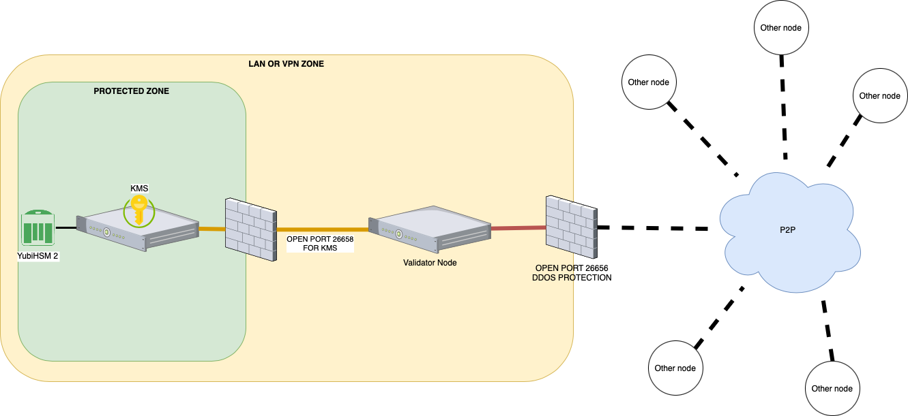

# KMS with YubiHSM2

## General concepts


## Hardware requirements


- SO: Ubuntu 18.04 (64-bit) or later  (preferably LTS version)
- Minimum amount of RAM: 4Gb
- Available disk space: 100 Gb
- Connect to the your validator node in private network (LAN or VPN)


## Scenario




For simplicity in the explanation we can assume that we have a vpn that connects the Data Center with the Cloud with the ip class

- **KMS**: `10.1.1.1`
- **Validator node**: `10.1.1.254`

The protection is at the port opening level and it's the following
- **KMS**: no open ports, only access to the lan or vpn towards the Validator node
- **Validator node**: 
     - port `26656` open on all ip
     - port `26658` open on all ip but with access limited to the KMS


## Installation

Upgrade your ubuntu system

```bash
sudo su -
apt update
apt upgrade -y
```

Create a new user to run the KMS server and reboot the system

```bash
mkdir /data_tmkms
useradd -m -d /data_tmkms/tmkms -G tmkms -s /bin/bash
echo 'SUBSYSTEMS=="usb", ATTRS{product}=="YubiHSM", GROUP=="tmkms"' >> /etc/udev/rules.d/10-yubihsm.rules
reboot
```

**Please note**: it might be necessary to restart the server several times to apply the rules

Install the components

```bash
sudo su -
apt install gcc git libusb-1.0-0-dev pkg-config -y
```

Install rust: language for compiling TmKms

```bash
su - tmkms
curl --proto '=https' --tlsv1.2 -sSf https://sh.rustup.rs | sh
source $HOME/.cargo/env

```

Install TmKms

```bash
cd $HOME
git clone https://github.com/tendermint/kms.git
cd $HOME/kms
cargo install tmkms --features=yubihsm --locked --force --version=0.10.0
```

Check the installation version

```bash
tmkms version
```

### YubiHSM2 Service Installation

The YubiHSM2 is a hardware device that must be connected to the server via USB. It is also necessary to install additional tools of the yubihsm in order to manage the connection as a service and not directly on usb.

Install yubico utilities. Search in [https://developers.yubico.com/YubiHSM2/Releases/](https://developers.yubico.com/YubiHSM2/Releases/) the right version for your system

```bash
sudo su -
cd /tmp
VERSION="yubihsm2-sdk-2019-12-ubuntu1804-amd64.tar.gz"
wget "https://developers.yubico.com/YubiHSM2/Releases/$VERSION"
tar zxf $VERSION 
sudo apt install ./yubihsm2-sdk/*.deb
rm -rf $VERSION
```

Activate the service

```bash
sudo tee /etc/systemd/system/yubihsm-connector.service > /dev/null <<EOF 
[Unit]
Description=YubiHSM connector
Documentation=https://developers.yubico.com/YubiHSM2/Component_Reference/yubihsm-connector/
After=network-online.target
Wants=network-online.target systemd-networkd-wait-online.service

[Service]
Restart=on-abnormal
User=tmkms
Group=tmkms
ExecStart=/usr/bin/yubihsm-connector -c /etc/yubihsm-connector.yaml
PrivateTmp=true
ProtectHome=true
ProtectSystem=full

[Install]
WantedBy=multi-user.target
EOF

systemctl enable yubihsm-connector.service
systemctl start yubihsm-connector.service
```
Check the service status and the listening port

```bash
systemctl status yubihsm-connector.service
ss -tlpn | grep 12345
```


### HSM Installation

Insert yubiHSM 2 into the usb slot. If the device has been used previously, reset it by holding down the metal ring for more than 3 seconds when the device is inserted.

You need to create a configuration file tmkms.toml containing the information of the validator node to which the Kms must connect.

You can find an example file below.       
Create the folder for the configuration

```bash
mkdir $HOME/kms/commercio
touch $HOME/kms/commercio/tmkms.toml

```
When using the 'tmkms' user, the value of the '$HOME' variable is '/data_tmkms/tmkms'. Make sure to use the complete path '/data_tmkms/tmkms'.
 

```toml
[[chain]]
id = "commercio-3"
key_format = { type = "bech32", account_key_prefix = "did:com:", consensus_key_prefix = "did:com:valconspub" }
state_file = "/data_tmkms/tmkms/kms/commercio/commercio_priv_validator_state.json"

[[validator]]
addr = "tcp://10.1.1.254:26658" # The ip of Validator Node
chain_id = "commercio-3"
reconnect = true # true is the default
secret_key = "/data_tmkms/tmkms/kms/commercio/secret_connection.key"

[[providers.yubihsm]]
adapter = { type = "http", addr = "tcp://127.0.0.1:12345" }
auth = { key = 1, password_file = "/data_tmkms/tmkms/kms/password" } # It is possible to enter the password directly using the password parameter instead of password_file
keys = [{ chain_ids = ["commercio-3"], key = 1 }]
serial_number = "9876543210" # identify serial number of a specific YubiHSM to connect to
```

For the creation of the file you need to have the following data
- Chain-id is the identifier of the chain for which the node is being configured. In the case of mainnet it is `commercio-3`
- Prefix of public addresses of the chain: in the case of commercio it is `did:com:`
- Prefix of the public addresses of the nodes: in the case of commercio it is `did:com:valconspub`
- Address within the lan or vpn of the validator node: for simplicity we have assumed to have the address `10.1.1.254`
- The password of our HSM device: initially the password is **"password"**
- The id of the key to use of the HSM: for the single configuration is `1`
- The serial Number of our device: generally it is what is indicated on the label of the YubiHSM2. They must be 10 digits. For the missing digits add zeros at the beginning
 

Create the file /data_tmkms/tmkms/kms/password and enter the password "password" inside it

```bash
printf "password" > /data_tmkms/tmkms/kms/password
```


#### HSM Reset
:::danger
:warning: This procedure will do a complete reset of the device. It must not be done for a possible second installation of another node that uses the same hsm
:::

```bash
tmkms yubihsm setup -c /data_tmkms/tmkms/kms/commercio/tmkms.toml
```

An output of this type should appear
```
This process will *ERASE* the configured YubiHSM2 and reinitialize it:

- YubiHSM serial: 9876543210

Authentication keys with the following IDs and passwords will be created:

- key 0x0001: admin:

    double section release consider diet pilot flip shell mother alone what fantasy
    much answer lottery crew nut reopen stereo square popular addict just animal

- authkey 0x0002 [operator]:  kms-operator-password-1k02vtxh4ggxct5tngncc33rk9yy5yjhk
- authkey 0x0003 [auditor]:   kms-auditor-password-1s0ynq69ezavnqgq84p0rkhxvkqm54ks9
- authkey 0x0004 [validator]: kms-validator-password-1x4anf3n8vqkzm0klrwljhcx72sankcw0
- wrapkey 0x0001 [primary]:   21a6ca8cfd5dbe9c26320b5c4935ff1e63b9ab54e2dfe24f66677aba8852be13

*** Are you SURE you want erase and reinitialize this HSM? (y/N): y
21:08:09 [WARN] factory resetting HSM device! all data will be lost!

21:08:11 [WARN] deleting temporary setup authentication key from slot 65534
     Success reinitialized YubiHSM (serial: 9876543210)
```

Confirm when asked to reinitialize the device (in bold in the output). Take note of the output, especially the 24 words provided as a new password (also in bold in the output above).
Save the new password of the file

```bash
printf "double section release consider diet pilot flip shell mother alone what fantasy much answer lottery crew nut reopen stereo square popular addict just animal" >/data_tmkms/tmkms/kms/password
```
**NB**: The password is provided on two separate lines but must be set in the file on a single line


### Key generation
The keys are generated using the tmkms command. The command is structured as follows

```bash
tmkms yubihsm keys generate 1 \
  -b steakz4u-validator-key.enc \
  -c /data_tmkms/tmkms/kms/commercio/tmkms.toml
```
Launch the command to produce the new key. The `-b` option allows you to save the key

:::danger  
:warning: The steakz4u-validator-key.enc backup file must be immediately transferred to the multiple off-line supports and secured. If it is lost, the key generated at this time can no longer be replicated.
:::

In the case of a new installation of the node, the key must be imported into the HSM. To do this, use the following command

```bash
tmkms yubihsm keys import \
  -t json \
  -i 1 priv_validator.json \
  -c /data_tmkms/tmkms/kms/commercio/tmkms.toml
```
:::danger  
:warning: The priv_validator.json backup file must be immediately transferred to the multiple, off-line, encrypted and secured supports. If it is lost, the key generated at this time can no longer be replicated.
:::

### Key confirmation
To confirm that the keys are present and configured in the HSM use the command

```bash
tmkms yubihsm keys list  -c /data_tmkms/tmkms/kms/commercio/tmkms.toml
```
Should be presented an output like the following

```
Listing keys in YubiHSM #9876543210:
- 0x0001: did:com:valconspub1zcjduepq592mn6xucyqvfrvjegruhnx55cruffkrfq0rryu809fzkgwg684qmetxxs
```
`did:com:valconspub1zcjduepq592mn6xucyqvfrvjegruhnx55cruffkrfq0rryu809fzkgwg684qmetxxs` is the public key of the validator node. This key will be needed to perform the validator node creation transaction


At this point the KMS can be connected to the Node

Test the KMS service
```bash
tmkms start -c /data_tmkms/tmkms/kms/commercio/tmkms.toml
```
An output like this should appear.
```
Mar 05 12:20:26.781  INFO tmkms::commands::start: tmkms 0.10.0 starting up…
Mar 05 12:20:27.280  INFO tmkms::keyring: [keyring:yubihsm] added consensus key did:com:valconspub1zcjduepq592mn6xucyqvfrvjegruhnx55cruffkrfq0rryu809fzkgwg684qmetxxs
Mar 05 12:20:27.280  INFO tmkms::connection::tcp: KMS node ID: 4248B5C7755600D694C47ECEA710A2DAB743AA38
Mar 05 12:20:58.682 ERROR tmkms::client: [commercio-3@tcp://10.1.1.254:26658] I/O error: Connection timed out (os error 110)
Mar 05 12:20:59.683  INFO tmkms::connection::tcp: KMS node ID: 4248B5C7755600D694C47ECEA710A2DAB743AA38
...
```

If the output reports errors other than simple connection failure then the installation should be checked.
**Please note**: The connection attempt fails because we have not yet configured the node to which the kms should connect.
crtl+c to abort the process.

### Config the service

```bash
sudo tee /etc/systemd/system/tmkms.service > /dev/null <<EOF 
[Unit]
Description=Commercio tmkms
After=network.target

[Service]
User=tmkms
WorkingDirectory=/data_tmkms/tmkms/.cargo/bin
ExecStart=/data_tmkms/tmkms/.cargo/bin/tmkms start -c /data_tmkms/tmkms/kms/commercio/tmkms.toml
Restart=always
StandardOutput=syslog
StandardError=syslog
SyslogIdentifier=tmkms
RestartSec=3
LimitNOFILE=4096

[Install]
WantedBy=multi-user.target
EOF

sudo systemctl enable tmkms
sudo systemctl start tmkms
```
### Config the validator node

To allow the validator node to access the private key, the `.commercionetworkd/config/config.toml` file must be modified.
Edit the parameter by putting the ip of the validator node

```toml
priv_validator_laddr = "tcp://10.1.1.254:26658"
```

Restart the service of the node

```bash
systemctl restart commercionetworkd
```

Check the output of the kms. Logs should vary in this way

```bash
Jan 11 09:23:14.389  INFO tmkms::session: [commercio-3@tcp://10.1.1.254:26658] connected to validator successfully
Jan 11 09:23:14.389  WARN tmkms::session: [commercio-3] tcp:/10.1.1.254:26658: unverified validator peer ID! (A312D8F64C9FC71A1A947C377F64B7302C951361)
```
